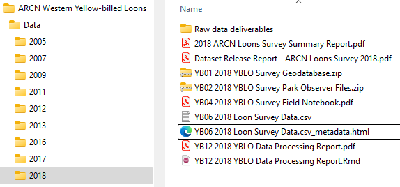
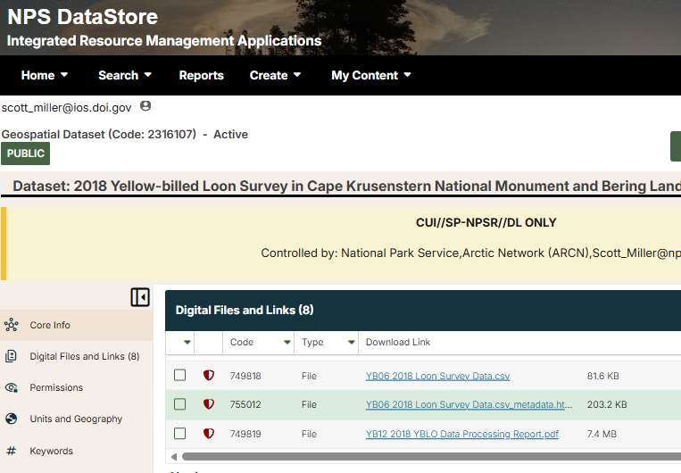

# Data Management Lifecycle And Procedures

The YBLO monitoring team recognizes the importance of following a fastidious and disciplined data management life cycle to promote data longevity and informational quality over an anticipated term of decades.

This section covers the data management life cycle for the Yellow-billed loons monitoring program after data is collected. For field data collection procedures and methods follow the standard operating procedures in (@flamme2018) available from the [Yellow-billed loons Project Reference](https://irma.nps.gov/DataStore/Reference/Profile/2216938) in the NPS Data Store.

## Collect data according to the YBLO standard operating procedures

Follow the data collection SOPs in the loons monitoring protocol and SOPs at <https://irma.nps.gov/DataStore/Reference/Profile/2216938>

## Organize and re-name raw data deliverable files

Upon returning from a field survey the first task is to organize and re-name raw field data deliverables in the loons monitoring shared directory (`O:\Monitoring\Vital Signs\Yellow-billed Loons\Data`). Figure 1 shows an example of a well organized data directory.

File organization and naming procedures are in the [Deliverables Schedule](DeliverablesSchedule.html) and personnel are expected to follow them closely. Doing so will assure future users know what is what, and will aid in backtracking data processing procedures if errors are discovered. Our goal is reproducibility and the highest data quality possible. Look over the Deliverables Schedule and/or familiarize yourself with how the previous year's data files are named and organized in the loons monitoring files directory. These file names are recorded in the database so that users can back-track, following a chain of processing steps to raw deliverable files if problems are encountered in the future.



Figure 1. A well organized loon survey data deliverables directory. Raw data files are separate from final, processed deliverables. Filenames are tagged with their deliverable identifiers. Data processing and quality control scripts and summaries are included.

## Process the deliverables for quality and logical consistency

There are no specific procedures for processing data quality, other than the suggestion to use a reproducible science platform such as R Markdown or Quarto, Python/Jupyter notebooks, etc. to document the procedures you undertook and data sources you used.

Putting effort into creating tidy data will make all the following data processing procedures easier. If you are not familiar with the concept of tidy data then please read @wickham2014tidydata (a fantastic, quick read that will make your life as a scientist much easier).

Look in prior year's data directories at data processing scripts prefixed with 'YB12' to see how data were processed for quality and database integration.

Look for:

-   Missing or erroneous spatial coordinates

-   Missing or impossible Plot numbers

-   Incidental (non-Plot) observations

-   Extraneous (non-protocol mandated) wildlife sightings

-   Consistent and standard species codes

-   Missing counts, nest, pair or other poor quality records

-   Validate the data against a report, if available

Data processing scripts are a deliverable (YB12) and should be saved in the survey's data directory and name similar to 'YB12 YYYY Loon Survey DESCRIPTION.ext'. Example: `YB12 2023 Loon Survey Data Processing Script.rmd`.

## Integrate the deliverables with the master loons monitoring database

Once the loon observations, lakes, plots and other files are processed you enter them into the loons monitoring SQL Server database. There are many methods to transfer data from deliverable files into a database. SQL Server Management Studio has a data import/export wizard. R and Python have packages and methods for moving data. You could also use Excel formulas to generate a series of INSERT queries. Data from 2005 - 2023 were moved via R scripts. Look for those scripts, prefixed with 'YB12' in the loons directories or References in Data Store. Modify the scripts as needed.

One easy way is to shape the dataset that is to be imported into the database such that each column is named exactly the same as the schema of the database's SurveyData table. Then you can generate a script of SQL INSERT queries using this function:

```{r,eval=FALSE,echo=TRUE}
# Function to convert a data frame into SQL INSERT queries
DataFrameToSQLInsertQueries <- function(SourceDataFrame, DestinationTableName) {
  
  # Helper: convert a single value to SQL literal
  ToSQLValue <- function(x) {
    if (is.na(x)) {
      return("NULL")
    }
    
    if (trimws(x) == '') {
      return("NULL")
    }
    
    if (is.character(x) || is.factor(x)) {
      x <- as.character(x)
      x <- gsub("'", "''", x)
      return(paste0("'", x, "'"))
    }
    
    if (inherits(x, "Date") || inherits(x, "POSIXct")) {
      return(paste0("'", as.character(x), "'"))
    }
    
    if (is.logical(x)) {
      return(ifelse(x, "1", "0"))
    }
    
    # numeric / integer → leave unquoted
    return(as.character(x))
  }
  
  # Get the source column names from the source data frame
  SourceColumnNames <- paste0("[", names(SourceDataFrame), "]", collapse = ",")
  
  # Build INSERT queries
  InsertQueries <- lapply(seq_len(nrow(SourceDataFrame)), function(i) {
    Row <- SourceDataFrame[i, , drop = FALSE]   # preserve types
    Values <- mapply(ToSQLValue, Row)
    SQLValues <- paste(Values, collapse = ", ")
    
    paste0("-- ",i,"\nINSERT INTO [", DestinationTableName, "](", SourceColumnNames, ")\nVALUES(",SQLValues, ");")
  })
  
  unlist(InsertQueries)
}


# START HERE: -----------------------------------------------------------------------------
# The DataFrameToSQLInsertQueries function converts a data frame (data, in example) to a series of SQL Insert queries
# The column names of the source data frame (data, in the example below)
# must exactly match the destination column names in the loons monitoring database
DestinationTableName = "SurveyData"
SQLFile = paste0(r'(C:\Temp\z)'," ",DestinationDatabase,"-",DestinationTableName,".sql")
SQL <- DataFrameToSQLInsertQueries(data,DestinationTableName)
SQLScript <- c(
  paste0("-- SQL INSERT queries script generated by ",Sys.info()[["user"]]," on ",Sys.Date()),
  paste0("USE [",DestinationDatabase,"];"),
  "BEGIN TRANSACTION; -- COMMIT ROLLBACK -- Don't forget to commit or rollback or the database will be left in a hanging state.",
  SQL
)
# Uncomment to write the INSERT queries to file
# writeLines(SQLScript, SQLFile)
```

## Run automated quality control procedures and repair/document defects

#### Queries

The loons monitoring SQL Server database has numerous quality control tests that can be done. Views (queries) prefixed by 'QC\_' are quality control views that will show potential errors. Use judgement, some results are warnings (Lake or Plot is NULL, for example) and not critical. Others show critical errors such as observations missing spatial coordinates.

#### Stored procedure

There is a stored procedure called `spDataQualityReport` that you may execute or open and run line by line to elucidate potential data quality problems. Run it by executing `EXEC spDataQualityReport`. This stored procedure is best executed with the results sent to text, rather than grids. See SSMS help.

#### Quality control scripts

The ARCN data manager has written numerous automated quality control and data summarization scripts in R Markdown and Quarto. \[Put GitHub link here when updated.\]

## Preliminarily analyze the data -\> Reprocess for quality if errors are further detected

The ARCN data manager has written numerous scripts in R Markdown and Quarto to generate quality control reports, data release reports and survey reports. These are available at \[GitHub link goes here\].

## Certify the dataset

The loons monitoring database has three levels of certification to describe data quality.

The NPS Arctic Network applies a tiered approach to communicating data quality. Records are tagged according to three levels of data quality as described in Table 1.

Table 1. Data quality definitions. The CertificationLevel is an attribute of the database's `SurveyData` table.

| Certification level | Definition |
|--------------------|----------------------------------------------------|
| Raw | Raw data that have not undergone any processing for quality. |
| Provisional | Provisional records have undergone quality control checks, defects have been rectified and/or documented and the survey results are suitable for internal reports. Observations have not been certified for release by the principal investigator, or have not been validated with a report or published journal article. |
| Certified | Certified records have undergone rigorous quality control checks, defects have been rectified and/or documented and the survey results have been validated with a report or published journal article or have been approved for release by the principal investigator. Certified records are analytical grade. |

Validate the records against a report, if available, or request certification approval from the project leader. Once this is done update the loons database `SurveyData.CertificationLevel` attribute to '`Certified`'. Also change the `CertificationDate` to the current date and the `CertifiedBy` attribute to your name.

## Publish the dataset

### Sensitivity

**Portions of the loons monitoring dataset are SENSITIVE and PROTECTED** ([@koelsch2019]). See [Data ownership and sensitivity](DataSensitivity.html).

Do not publish loons and nest locations publicly.

### Data Store Reference Types

Loons monitoring data must be published to the NPS Data Store in two ways (Table 1).

Table 1. Two major methods of data publication in the NPS Data Store. Both methods must respect protected data mandates.

| Dataset type | Public | Analytical grade | Description |
|-----------|-----|----------|-----------------------------------------------|
| Annual survey files | No | No | This dataset type consists of data files and documentation from an individual, annual loon survey. *These data are archival grade and are not certified for analysis*. They are retained in Data Store in case errors are detected, or clarification is needed in the future. |
| [Certified cumulative dataset](https://irma.nps.gov/DataStore/Reference/Profile/2316912)\* | No | Yes | The certified, cumulative dataset is intended for analytical use. Each survey year data are processed for quality and appended into the master loons monitoring SQL Server database. Once data are certified new data and metadata files are exported and the [Certified Dataset Reference](https://irma.nps.gov/DataStore/Reference/Profile/2316912)\* is [versioned](https://irma.nps.gov/DataStore/DownloadFile/717239), modified, and the new files attached. |

*\*The link to this Data Store Reference is current as of this writing, but will change as the Certified Dataset Reference is versioned over time. Data Store points users from older versions to newer versions of datasets, so clicking the link shown will lead you to the latest version.*

#### Annual survey files publication

The raw and processed annual survey data deliverables are published privately in the IRMA Data Store (Figure 2). These files are not intended to be published to the public, but rather are archived for NPS use in case questions arise later on data or methodology.

Procedure:

1.  Ensure that the annual survey files are in the loons monitoring shared drive, in a directory tagged with the year and all deliverables are named according to the scheme in the Deliverables Schedule (see Figure 1 for an example), and data files are documented with metadata, as needed.

2.  Navigate to the [Loons Monitoring Project Reference in Data Store](https://irma.nps.gov/DataStore/Reference/Profile/2216938) and find the last survey's Geospatial Dataset Reference.

3.  Clone last year's Geospatial Dataset Reference. Consult the [Data Store Help](https://irma.nps.gov/Content/DataStore/Help/), if needed.

4.  Modify the details to suit the current survey.

5.  Upload the current year's deliverable files as holdings *\[Note: this is your last chance to make sure the files are absolutely correct. Once the Reference is activated you will not be able to change them out. You will have to version the Reference to make corrections, or contact the IRMA team for help.\]*

6.  Ensure the permissions are correct. The Reference will be public, by default, but file access should be NPS-Internal (private).

7.  Activate the Reference.

8.  Next you will add the new Reference as a Product of the loons monitoring Project Reference. Copy the Reference code.

9.  Open the [Loons Monitoring Project Reference in Data Store](https://irma.nps.gov/DataStore/Reference/Profile/2216938) in edit mode.

10. Navigate to Products.

11. Link the new Geospatial Dataset Reference as a Product.

12. Ensure the new Reference shows up as a Product of the Project Reference.

13. Extra credit: Data Store does not sort Products logically. Move the new Reference up so that it sorts nicely and logically with the other Products.

**Tips**

-   Look at the previous survey's data in the loons shared drive (Figure 1) as well as the [Deliverables Schedule](DeliverablesSchedule.html) and make sure all the files are named correctly and the deliverables are as complete as possible.

-   Look at a previous survey's Geospatial Dataset Reference (Figure 2).

-   Go to the master [Loons Project Reference in Data store](https://irma.nps.gov/DataStore/Reference/Profile/2216938) and look at the previous year's Products metadata and files.

-   Contact the ARCN data manager for assistance.

{width="520"}

Figure 2. Example of an annual loon survey deliverables archived as a Geospatial Dataset in NPS Data Store. Annual survey files (see Deliverables Schedule and Figure 1.) are archived as private, NPS-Internal References in Data Store.

#### Certified dataset publication

Publishing the certified dataset is relatively straightforward. The dataset is cumulative - each year's data is appended to the SurveyData table in the loons monitoring master database. From there the `Dataset_Certified` query is exported to a CSV file. Then, the [Certified Dataset Reference](https://irma.nps.gov/DataStore/Reference/Profile/2316912) in Data Store is versioned with the new file.

**Procedure:**

1.  Examine the loons monitoring database contents. Ensure the latest survey data are imported into the database, have undergone quality control procedures, and all records to be published have the attribute `CertificationLevel` tagged as '`Provisional`' or '`Certified`' (records tagged 'Raw' will be excluded from the `Dataset_Certified` view).

2.  Navigate to `O:\Monitoring\Vital Signs\Yellow-billed Loons\Data\Certified dataset and d`elete all the files (this is just a temporary storage location - these files should already be in Data Store).

**Method 1: SQL Server Management Express/Excel**

1.  Next, open SQL Server Management Studio, open the Object Explorer and navigate to the ARCN_Loons database.

2.  Click New Query...

3.  Execute `SELECT * FROM Dataset_Certified`

4.  The data appears in a grid. Right click the grid and select 'Copy with headers'.

5.  Open Microsoft Excel and paste the data.

6.  Save the data as Comma Separated Values text file to the Certified Dataset directory described above.

**Method 2: R script (better)**

1.  In a browser navigate to the [ARCN_Loons_R_Scripts](https://github.com/NPS-ARCN-CAKN/ARCN_Loons_R_Scripts) GitHub repository

2.  Either fork the repository, download it as a .zip archive, or copy the contents of `ARCN Loons Certified Dataset Release Report.Qmd` into a new .Qmd file in R Studio.

3.  The script is well documented. Follow the directions to export the `Dataset_Certified` view to a CSV file (contact the ARCN data manager for permissions. The script will also generate a Data Release Report.

**Version the Certified Dataset Geospatial Dataset Reference in Data Store**

1.  Open the [Certified Dataset Reference](https://irma.nps.gov/DataStore/Reference/Profile/2316912) in a browser. You may need to request permissions from the ARCN data manager.

2.  Clone it.

3.  Modify the details.

4.  Upload the certified dataset CSV file you created above.

5.  Optionally, generate a Data Release Report (described above) and upload it.

6.  Ensure the file access is NPS-Internal.

7.  Activate the Reference.

## Review and revise the Standard Operating Procedures

If any methodologies have improved or changed significantly then update the [SOPs](https://irma.nps.gov/DataStore/Reference/Profile/2216938).
